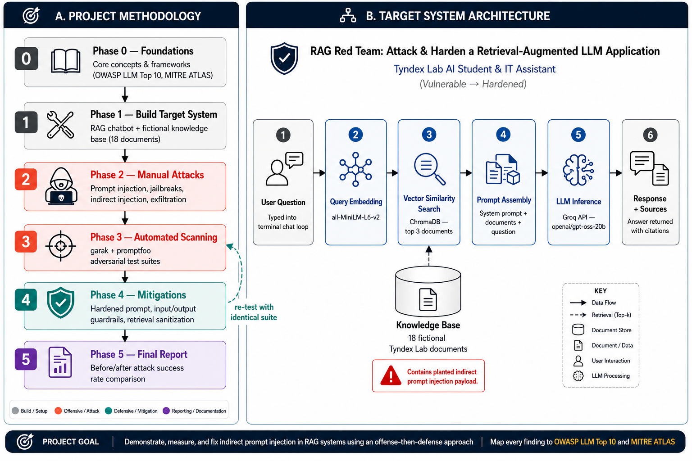

# RAG Red Team: Attack & Harden a Retrieval-Augmented LLM Application

> A hands-on offensive + defensive security assessment of a RAG-based chatbot, mapped to the OWASP Top 10 for LLM Applications and MITRE ATLAS.

**Status:** 🟡 In Progress — Phase 1 of 5
**Author:** [Your Name] | [LinkedIn] | [Portfolio]

---

## TL;DR (for recruiters/hiring managers)

- Built a RAG chatbot (LLM + vector DB) as an attack target
- Ran manual + automated adversarial testing (garak, promptfoo) covering prompt injection, indirect injection, jailbreaks, and data exfiltration
- Mapped every finding to **OWASP LLM Top 10** and **MITRE ATLAS** technique IDs
- Implemented layered defenses and re-ran the identical attack suite to produce measurable before/after results
- **Result:** [fill in once done, e.g. "Reduced successful attack rate from 62% to 11% across 40 test cases"]

📄 Full report: [`docs/05-final-report.md`](docs/05-final-report.md)
📊 Before/after results: [`results/`](results/)

---

## Why this project

[2-3 sentences: your motivation, what gap it fills in your background, what you wanted to learn]

## Architecture



- **LLM:** Groq API (Llama 3.1/3.3)
- **Embeddings:** sentence-transformers (all-MiniLM-L6-v2)
- **Vector store:** ChromaDB (local)
- **Guardrails:** Llama Guard (Phase 4)

## Repo structure

```
docs/           phase-by-phase writeups, findings, final report
results/        raw scanner output, pre- and post-mitigation
src/            application code (target system + defenses)
```

## How to run

[fill in once Phase 1 is built]

## Frameworks referenced

- [OWASP Top 10 for LLM Applications](https://owasp.org/www-project-top-10-for-large-language-model-applications/)
- [MITRE ATLAS](https://atlas.mitre.org/)

## Project log

| Phase | Status | Doc |
|---|---|---|
| 0 — Foundations | 🟡 | [docs/00-foundations.md](docs/00-foundations.md) |
| 1 — Build target system | ⬜ | [docs/01-architecture.md](docs/01-architecture.md) |
| 2 — Manual attacks | ⬜ | [docs/02-manual-findings.md](docs/02-manual-findings.md) |
| 3 — Automated scanning | ⬜ | [docs/03-automated-scan.md](docs/03-automated-scan.md) |
| 4 — Mitigations | ⬜ | [docs/04-mitigations.md](docs/04-mitigations.md) |
| 5 — Final report | ⬜ | [docs/05-final-report.md](docs/05-final-report.md) |
